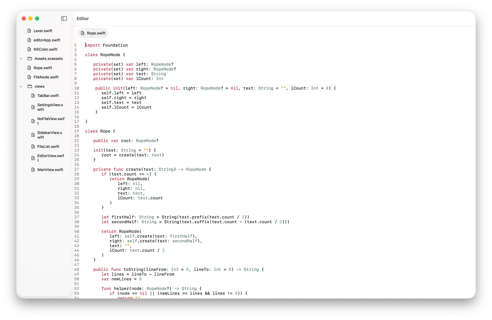

# MacOS Text Editor
Work in progress native MacOS text editor built with Swift and SwiftUI / AppKit as the GUI library. This project was built as a learning experience to further my knowledge in Swift and Apple ecosystem development in general, declarative GUI libraries and designing moderately sized projects.

### Features
- Open and read files
- Apply syntax highlighting (Swift only currently)
- Edit text
- View system files in a file viewer
- More to come

# Technical Details
### Text Representation
Text loaded from an opened file is represented in memory using the [rope](https://en.wikipedia.org/wiki/Rope_(data_structure)) data structure. A rope is essentially a binary tree where each leaf node holds part of the original string (4 characters each in the case of this editor) and each internal node stores the weight of nodes in it's left subtree.

Ropes provide a more efficient way of storing and manipulating text than a traditional character array. For example, in order to insert text into a normal character array the entire array may need to be recreated with the additional string or have large portions shifted. For small strings of text this is manageable, but for large files that need operations frequently this becomes an arduous task. The rope data structure solves this by finding the insertion point, splitting the leaf node if needed, inserting / concatenating new text and potentially rebalancing the tre. This performs in O(log n) time as opposed to O(n) (assuming a properly balanced tree).

### Syntax Highlighting
To add syntax highlighting to the editor I implemented a simple lexer to tokenise the file text and highlight each token.

The lexer works by running through a list of Regex rules to detect common Swift lexical elements, e.g. keywords like class and let, strings, numbers etc. and at each detection storing the matched text as token and moving forward by the token's length. This outputs an array of tokens each with type, text, start, length and line number attributes.

From there the editor renders text by looping over the output token array and  drawing each token with a pre-determined colour.

